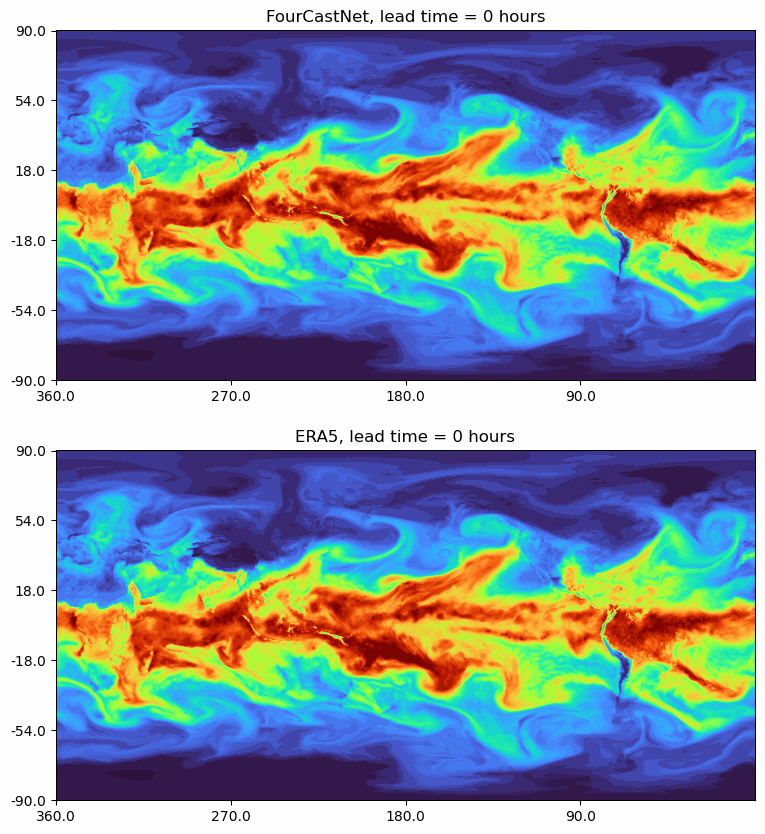

# Instructions to run Weather Sheaf POC

It is recommended to first create and activate a new conda environment (conda can be [installed here](https://docs.conda.io/projects/conda/en/latest/user-guide/install/index.html))

```bash
conda create --name weather_sheaf python=3.11 && conda activate weather_sheaf
```


Install the required dependencies:
```bash
pip install -r requirements.txt
```

In the POC, the *Inference Server* application, and the *Client Interface* application are intended to be run together, while the *Fourcaster Node Trainer* is intended to run separately stand-alone. Ensure you have a stable internet connection.

You can now run both the Inference Server and Client Interface with a single command using the provided shell script:

1. Make the script executable:
   ```bash
   chmod +x run_weather_sheaf_poc.sh

2. Locally start the inference server and the client application:
   ```bash
   ./run_weather_sheaf_poc.sh

The inference server will first download the FourCastNet backbone model weights from a S3 bucket (~900mb), and then start listening on port 5001 for client inputs. The client app can be accessed in a web browser via the localhost URL printed to the terminal.

On the client interface you can add your latitude, longitude coordinate, 
push Query Weather AI button to apply the forecast model running on the inference server to hourly updated weather data in your location pulled by the server in realtime from Open-Meteo weather API. 

Optionally you can push the Generate Distribution button to generate a reference probability distribution, that is sent to the server to compute the metrics "Accuracy", "Decisiveness", "Robustness" against the forecast model output distribution, which are then displayed to the client interface. 

It is also possible to upload a custom CSV file with an array of probabilities (has to be of size 1000 probabilities with current setup). This provided array is assumed to represent ground-truth probability values for your data and variables of interest, to be used for qualitatively assessing the AI forecast along the three metrics.

If no reference dsitribution is provided, the metrics are computed on the server on randomly generated data.

Processes received coordinates from the client app to fetch meteorological data from Open-Meteo API along the 20 features on which FourCastNet is trained, specifically the latest recorded (hourly updated) measurements of these features are fetched from the Open-Meteo API;

Weather Variables:

- temperature_2m
- relative_humidity_2m
- precipitation
- pressure_msl
- surface_pressure
- wind_speed_10m
- wind_direction_10m
- temperature_1000hPa
- geopotential_height_1000hPa
- wind_speed_1000hPa
- wind_direction_1000hPa
- temperature_850hPa
- geopotential_height_850hPa
- relative_humidity_850hPa
- wind_speed_850hPa
- wind_direction_850hPa
- temperature_500hPa
- geopotential_height_500hPa
- relative_humidity_500hPa
- wind_speed_500hPa
- wind_direction_500hPa
- geopotential_height_50hPa
- total_column_integrated_water_vapour


This data is then converted on-the-fly into a PyTorch dataset of correct input format for the FourCastNet backbone, and inference is performed to generate a probability distribution from the ProbabilitiesGenerator module wrapping the backbone model. 

Moreover, the server processes the reference probability distribution (which is provided by the client user, e.g. constructed
from relevant historical data), to compute the 3 distributional comparison-metrics "Accuracy", "Decisiveness", "Robustness" with the generated probability distribution and the reference probability distribution as inputs. The computation of these three metrics can be performed either by calling the Photrek sercive via SingularityNET on the Ethereum blockchain (using the call_photrek module on the inference sersver), or alternatively for simplicity/efficieny can be computed without calling the blockchain using an attempted reimplementation of the algorithms of Photrek service running as a simple python module locally on the server.

If using the Photrek service: 

- Set the variable USE_PHOTREK = True at the top of the script inference_server.py
- Add your Ethereum wallet private key, and your Infura API key to the file phot_config.py

If USE_PHOTREK = False (the default) presumably equivalent computations of the three comparison metrics is performed locally on the server using pytorch and numpy.

The data is then sent back to the querying client application over websockets.


To run the client-server process stand-alone:

1. Start the *Inference Server*:
```bash
python inference_server.py
```
The server will start listening on port 5001. Note that this will also download the AFNONet model and set it up for inference the first time you run the app (or after deleting the previously downloaded model) it is around 900mb big.

2. Launch the *Client Interface* stand-alone:
```bash
streamlit run client_app.py
```


3. To run the *Forecaster Node Trainer* with some example settings:
```bash
 python train_forecaster_node.py --dist_type normal --mean 0.0 --std 1.0 --num_samples 1000 --acc 1.0 --dec 1.0 --rob 1.0
```
 (might be slow on CPU) This locally trains a custom ProbabilityGenerator model, which is a wrapper module around the backbone AFNONet model generating a probability distribution of any size.
The utilisation of the pre-trained AFNONet backbone model ensures that the resulting probabilities-generator is physically grounded in its pre-training while adapting the generated distribution to user-defined dataset and distributional characteristics.

The arguments acc, dec, rob, are the (normalised) weights in the distributional loss function of three respective metrics "Accuracy" (cross entropy), "Decisiveness" and "Robustness", defining characteristics of the optimization proceedure of the generated distributions from the trained model. 


# Project Motivation

This repository contains the code demonstrating a POC for Weather Sheaf -
providing a new computational framework for local extreme weather forecasting, enhanced by a global decentralised network of AI model developing compute nodes.

The project aims to address the following important problems:

* Local low-probability events are hard to accurately estimate and predict even for state of art global weather forecasting models.

* In times of steadily increasing climate uncertainty and risk, there is an increasing need among individuals and businesses, both big and small, to quickly be able assess the risk of of extreme weather events at specific times and locations on earth.

* Accurate statistical models of local extreme weather events are often big and expensive to develop and run, giving unequal access to actionable information for many groups especially vulnerable by the consequences of extreme weather.

# Steps towards resilient weather risk mitigation in times of increased uncertainty

Open source state of art AI models for global weather prediction, together with widely available large weather data sets via public APIs lowers the barrier of entry for anyone to actively contribute to developing global weather forecasting models with stronger local prediction power.

Using a new promising statistical inference framework, grounded in the mathematical theory of Sheafs, new state of art models for local prediction can be more robustly developed.

Sheaf theory stems from theoretical mathematics, originally within the field of algebraic topology, but have in recent years received an increased interest within applied mathematics, particularly in machine learning and sensor fusion.

In the context of forecasting models, sheaf theory provides a promising mathematical framework for composing high-performing ensambles of small AI models deployed to edge devices in a network, into one super model with enhanced local prediction power for all network nodes.

This framework is ideally deployed on a blockchain, due to the following proposed incentive structure:

* Local compute hubs are rewarded in proportion to the amount of compute they spend on developing models contributing to the global super model.
* Local compute hubs are also rewarded in proportion to the amount of information-theoretical gain in accumulated prediction power from their local model across all prediction queries, hence incentivicing creation of high quality in-situ datasets and models.
* The thus developed prediction models are made accessible via the blockchain to companies, individuals, and weather API providers, in order to accumulate a pool of reward tokens distributed via the blockchain to all contributors to the decentralised network super model.
* The result is a resilient network for risk prediction, that serves as an unbiased complement to enhance existing forecasting models with better in-situ prediction models.

This framework is not limited to weather forecasting, but can be generalised to any type of risk forecasting with similar characteristics of local <-> global enhancement potential in the development of forecasting models.

# AI model backbone

The Weather Sheaf POC uses as AI model backbone "FourCastNet: A Global Data-driven High-resolution Weather Model using Adaptive Fourier Neural Operators" \[[paper](https://arxiv.org/abs/2202.11214)\]. 

This is a good choice of model because
* FourCastNet is highly efficient and fairly small, and can be easily deployed even to personal computers with only a CPU available for inference computation.
* The model is by design intended for building large diverse forecasting ensambles.
* The source code and pre-trained model weights are available open source.

For this project, we have developed a probability distribution generator head (the ProbabilitiesGenerator module in /networks/afnonet.py) that can be attached as a decoder to the output from the FourCastNet model backbone. The idea is to let any compute hub in the decentralised network develop a forecasting model utilising the prediction power of the backbone model, by training the ProbabilitiesGenerator on their own in-situ dataset to predict the variables of their interest. 

FourCastNet, short for Fourier Forecasting Neural Network, is a global data-driven weather forecasting model that provides accurate short to medium-range global predictions at 0.25∘ resolution. FourCastNet accurately forecasts high-resolution, fast-timescale variables such as the surface wind speed, precipitation, and atmospheric water vapor. It has important implications for planning wind energy resources, predicting extreme weather events such as tropical cyclones, extra-tropical cyclones, and atmospheric rivers. FourCastNet matches the forecasting accuracy of the ECMWF Integrated Forecasting System (IFS), a state-of-the-art Numerical Weather Prediction (NWP) model, at short lead times for large-scale variables, while outperforming IFS for variables with complex fine-scale structure, including precipitation. FourCastNet generates a week-long forecast in less than 2 seconds, orders of magnitude faster than IFS. The speed of FourCastNet enables the creation of rapid and inexpensive large-ensemble forecasts with thousands of ensemble-members for improving probabilistic forecasting. We discuss how data-driven deep learning models such as FourCastNet are a valuable addition to the meteorology toolkit to aid and augment NWP models.

FourCastNet is based on the vision transformer architecture with Adaptive Fourier Neural Operator (AFNO) attention proposed in Guibas-Mardani et al. \[[paper](https://openreview.net/pdf?id=EXHG-A3jlM)\], \[[code](https://github.com/NVlabs/AFNO-transformer)\].

The model is trained on a subset of ERA5 reanalysis data on single levels [ Hersbach 2018 ] and pressure levels [ Hersbach 2018 ] that is pre-processed and stored into hdf5 files.

The subset of the ERA5 training data that FCN was trained on is hosted at the National Energy Resarch Scientific Computing Center (NERSC). 





# Next steps for the Weather Sheaf project

The algorithm intended to be deployed for the Weather Sheaf project, enables a network of compute hubs to train their own local models for predicting any distributions or variables of their interest, and then synthesises all models in the network to a common backbone "super-model". This "super-model" is a data-dependent ensamble of all models in the network utilising a Clebsch-Gordan-like tensor product for linear composition on the level of model state spaces. In the POC we are however currently only utilising one particular pre-trained backbone model (the "trivial" special case of the algorithm when the network has number of compute nodes N=1). 

The compositions of the model ensamble from the network of nodes depends on a certain dependency-graph of total correlation (in the sense of generalised mutual information) across all models in the network.

A central next step of the project is hence to implement the general algorithm and validate the thus constructed inference mechanism.

We also want to enable model-developing compute hubs in the network to:
1) Upload their developed model to the network and log it with a unique model_id on the blockchain
2) at client inference time, log the information-theoretic gain in prediction power for particular queries and particular model ensamble components, in order to integrate this information with the blockchain reward mechanism for model developers.

This system was envisioned and developed as POC by applied mathematician Nils Kakoseos Nyström (niknymusing.github.io), amongst other things building on his work in algorithmic reasoning and continual self-reinforced learning.

The sheaf-learning framework outlined at high level above is a central part of a generalised learning system which explores data fetched via online publicly available APIs. Especially to improve the machine learning systems internal reward mechanisms, and capability of data space exploration within a self-reinforcing and open-ended continual learning process.

Weather data is one very useful source of continually updating data-streams, and it is our strong belief that developing a generalised learning system able to explore such continually updated online data-streams in this open-ended way might lead to significant progress towards better generalising AI systems, that can be a significant stepping stone towards AGI. The "grander vision" here is also to take these incremental steps towards AGI while benefiting climate science, weather forecasting, and humanity more broadly going forward.

